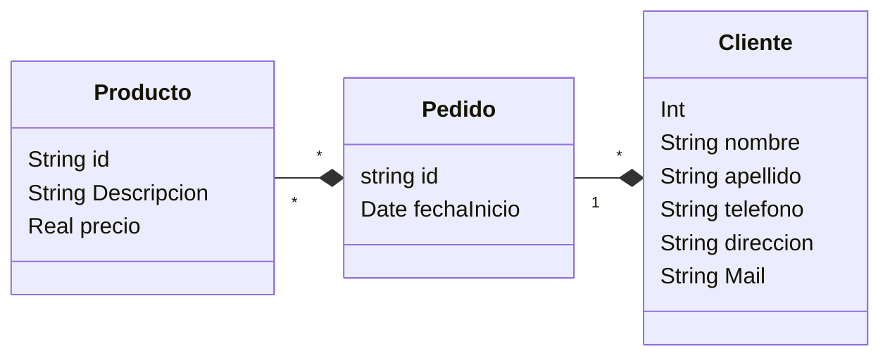

# Links

[POC REPO MECA](https://github.com/utnfrrodsw/poc)

# Cosas para comparar

- Documentación
- Comunidad
- Migraciones
- Proceso de Desarrollo (querys, código)
- Velocidad (performance)

# Fomato de Datos

