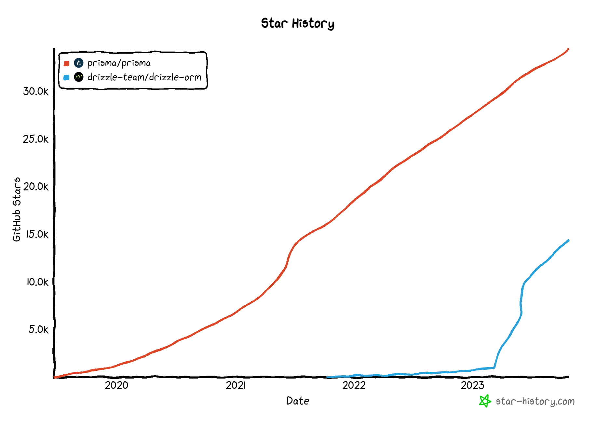
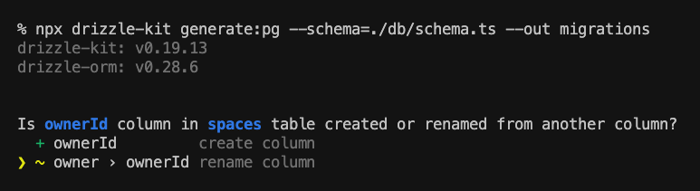
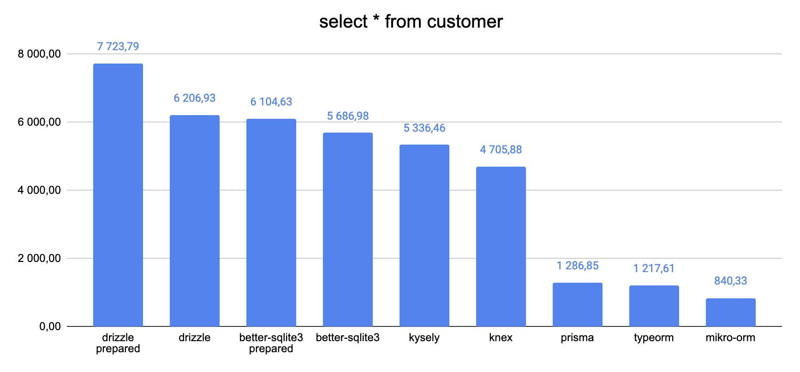
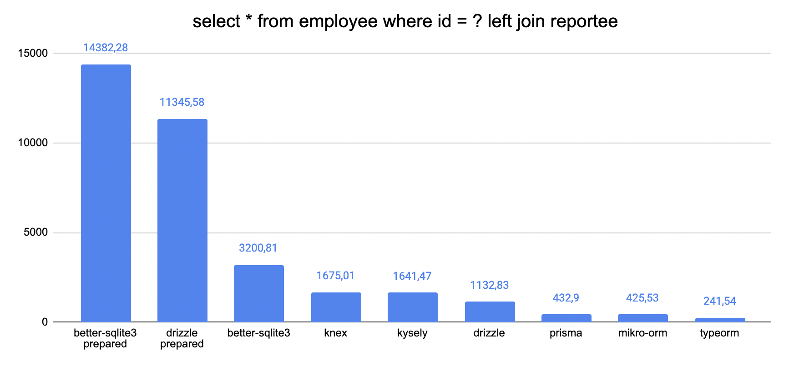

# Drizzle

## Documentación

La documentación de Drizzle es efectiva, siendo al mismo tiempo simple y completa. Proporciona las pautas necesarias para una implementación correcta de Drizzle.

## Comunidad

La comunidad de Drizzle es muy dinámica y, según las tendencias actuales, es probable que se convierta en uno de los ORMs más populares en el entorno de TypeScript. A pesar de tener menos estrellas en GitHub en comparación con Prisma, es importante destacar que Drizzle es un proyecto más reciente.


## Proceso de Desarrollo

### Formato de los Datos

Drizzle emplea TypeScript para definir la estructura de los datos (esquema).

```typescript
export const cliente = pgTable("cliente", {
  id: uuid("id").defaultRandom().primaryKey(),
});

export const clienteRelations = relations(cliente, ({ many }) => ({
  pedido: many(pedido),
}));

export const pedido = pgTable("pedido", {
  id: uuid("id").defaultRandom().primaryKey(),
  cliente_id: uuid("cliente_id")
    .notNull()
    .references(() => cliente.id),
});
```

En este caso se establece una clave foránea en la entidad "pedido" que hace referencia al cliente que realiza el pedido, lo que crea una relación entre las entidades "cliente" y "pedido".

Nuestra opinión sobre la definición del esquema es que Drizzle podría sacrificar cierta legibilidad al optar por utilizar TypeScript para definir las relaciones entre los datos. Si uno está familiarizado con TypeScript, esto puede no ser un problema significativo, pero en nuestra opinión, la forma en que Prisma aborda esta tarea resulta más legible.

### Migraciones

[zenstack - Drizzle vs Prisma](https://zenstack.dev/blog/drizzle-prisma#iteration-speed)

Una vez que se ha realizado una modificación en el esquema de datos en Drizzle, basta con ejecutar un comando, y el sistema se encarga de aplicar los cambios en la base de datos. Este proceso es muy similar al funcionamiento de Prisma. La principal distinción entre Drizzle y Prisma radica en el uso de TypeScript para definir el esquema en Drizzle, mientras que Prisma utiliza su propia sintaxis.

Drizzle también incluye una función interesante que se activa cuando se renombra una columna. Esta función permite crear una nueva columna o modificar el nombre de la columna existente, evitando así la eliminación accidental de una columna.


### Generar el cliente

Dado que Drizzle utiliza TypeScript para definir el esquema de datos, puede aprovechar la inferencia de manera directa. Por lo tanto, una vez que se han realizado los cambios en el esquema, no es necesario ejecutar una migración adicional para empezar a aprovechar esta inferencia.

### Sintaxis y Querys

[Prisma - Drizzle vs Prisma](https://www.prisma.io/docs/concepts/more/comparisons/prisma-and-drizzle)

[Querying](https://orm.drizzle.team/docs/rqb#querying)

Drizzle proporciona al usuario la posibilidad de utilizar operadores similares a los que se emplean en SQL al realizar consultas. La sintaxis utilizada en las consultas de Drizzle es muy parecida a la de SQL, aunque con un aspecto más estilizado. Además, se puede aprovechar la inferencia de TypeScript en estas consultas. En esencia, Drizzle se basa en SQL, lo que puede considerarse tanto una ventaja como una desventaja, dependiendo de la familiaridad del usuario con el SQL.

En contraste, Prisma utiliza algunos operadores que resultan más amigables para aquellos que no están familiarizados con SQL. Esta diferencia en enfoque es importante y debe ser tenida en cuenta al elegir entre Drizzle y Prisma.

```typescript
await db.query.posts.findMany({
  where: (posts, { eq }) => eq(posts.id, 1),
  with: {
    comments: {
      where: (comments, { lt }) => lt(comments.createdAt, new Date()),
    },
  },
});
```

En este ejemplo con Drizzle, estamos realizando una búsqueda de un post con id = 1. El operador eq se encarga de la operación de igualdad, lo que significa que estamos buscando un post cuyo identificador sea igual a 1. Además, se utiliza el operador lt, que significa "menor que" (less than), para seleccionar comentarios con una fecha de creación anterior a la fecha actual, representada por new Date().

### ¿Por qué drizzle es mas rápido que prisma?

Drizzle es una evolución de Prisma, y por esta razón, muchas de las comparaciones se realizan directamente con Prisma. Por lo tanto, a continuación, vamos a realizar comparaciones directas entre Drizzle y Prisma en varios de estos casos.

#### Performance

[prisma is slow](https://www.youtube.com/watch?v=J2j1XwZRi30)

Drizzle se destaca por su velocidad como ORM, ya que consiste en una fina capa de abstracción en TypeScript sobre SQL. A diferencia de otros ORMs, como Prisma, Drizzle realiza únicamente una consulta (query) por cada sentencia.

En contraste, Prisma se considera más lento en comparación con Drizzle. Prisma utiliza un motor escrito en Rust que inicialmente se diseñó para admitir múltiples lenguajes, pero en la actualidad, Prisma ha dejado de brindar soporte a GoLang, y su enfoque se centra en TypeScript y JavaScript. Además, Prisma utiliza múltiples consultas para realizar operaciones de unión (joins) en la base de datos. En lugar de que la base de datos realice los joins directamente a través de SQL, Prisma trae los datos a su motor en Rust y realiza las operaciones de unión allí. Esto obliga a realizar múltiples consultas a diferentes tablas para recopilar el conjunto completo de datos que se necesita para las operaciones de unión.

Drizzle aborda este proceso de manera más eficiente, ya que traduce su sintaxis a una sentencia SQL y, por lo tanto, puede realizar una sola consulta a la base de datos. Este enfoque agiliza significativamente el rendimiento de Drizzle en comparación con Prisma.

#### Prepeared Statements

[Query performance](https://orm.drizzle.team/docs/perf-queries)

Un aspecto sumamente útil que nos proporciona Drizzle es la capacidad de utilizar Prepared Statements (Declaraciones Preparadas). Estas declaraciones preparadas permiten, en lugar de llamar al generador de consultas cada vez que necesitamos realizar una consulta, construir la consulta y dejarla preparada para su uso a través de una constante en JavaScript. Esto nos habilita la posibilidad de emplear estas consultas preparadas con variables internas, lo cual optimiza el tiempo necesario para construir la consulta en el momento de su ejecución.

A continuación, se presenta un ejemplo de cómo se utilizan las declaraciones preparadas en Drizzle:

```typescript
const p1 = db
  .select()
  .from(customers)
  .where(eq(customers.id, sql.placeholder("id")))
  .prepare("p1");

await p1.execute({ id: 10 });
await p1.execute({ id: 12 });
```

Este enfoque ahorra tiempo en la traducción de la consulta a SQL en cada ejecución, ya que la consulta se construye una vez y se almacena en la constante "p1". Luego, simplemente utilizamos la consulta que se había preparado anteriormente. Comparado con la alternativa en la que se genera la consulta desde cero en cada ejecución, este enfoque resulta más eficiente y beneficioso.

#### Benchmarks

[benchmark](https://github.com/drizzle-team/drizzle-northwind-benchmarks)

Desde un punto de vista técnico, es relevante mencionar que estos benchmarks son elaborados por el propio equipo de Drizzle. Aunque provienen de fuentes internas, estos benchmarks tienen un valor significativo al ilustrar las diferencias de rendimiento entre Drizzle y otras soluciones ORM. Además, ofrecen datos comparativos que muestran cómo se comporta Drizzle al utilizar declaraciones preparadas en comparación con el escenario donde no se utilizan. Estos resultados resultan esenciales para comprender el rendimiento de Drizzle en diversas situaciones, lo que los convierte en una valiosa fuente de información al evaluar su idoneidad para proyectos específicos.

Este conjunto de pruebas nos proporciona información sobre la cantidad promedio de consultas por segundo. Para ilustrar este punto, comencemos con los datos relacionados con una operación "select all".

Como se puede observar, incluso en una consulta aparentemente sencilla, como un "select all," se aprecia una marcada diferencia en la cantidad de consultas realizadas por segundo entre el uso de "prepared statements" y la omisión de los mismos.


En este ejemplo, que implica una consulta algo más compleja al incluir un "select," "where" y un "left join," la diferencia en el rendimiento es aún más evidente. Preparar una consulta de esta magnitud en cada ejecución tiene un impacto notable en la cantidad de consultas que se pueden realizar por segundo.

## Conclusion

Drizzle es una herramienta que destaca por su flexibilidad y sencillez. A pesar de su simplicidad, logra ofrecer un rendimiento superior en comparación con la mayoría de los ORMs populares, especialmente cuando se utilizan prepared statements.

Sin embargo, es importante tener en cuenta que al utilizar Drizzle, es necesario gestionar las operaciones de "left join" manualmente. Por lo tanto, si estás buscando una herramienta que te libere completamente de escribir SQL, es posible que Drizzle no sea la mejor opción en ese aspecto.

En resumen, Drizzle se presenta como una elección ideal para aquellos que buscan una ORM que facilite la administración de migraciones y la definición del esquema de datos de manera sencilla. Si además valoras la velocidad, Drizzle, especialmente cuando se utilizan prepared statements y teniendo en cuenta que genera solo una consulta por cada sentencia, se convierte en una de las opciones más sólidas.
