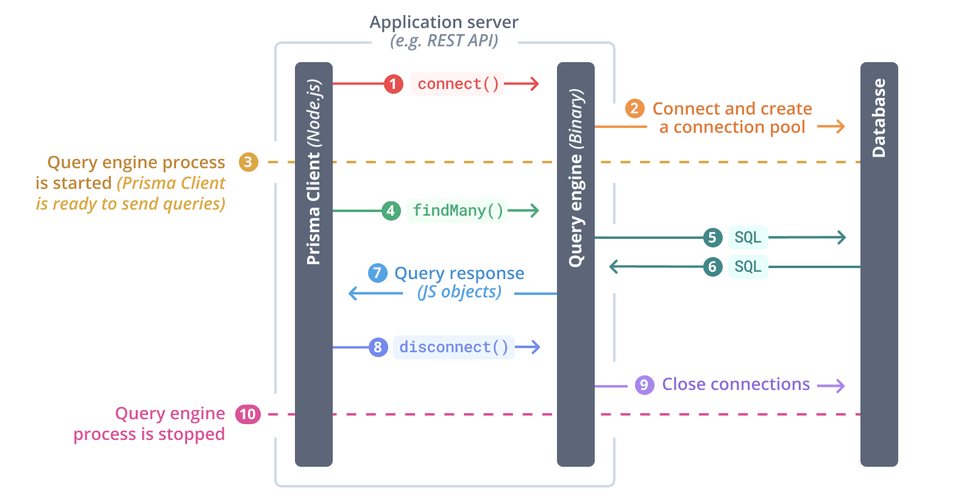

# Drizzle

## Documentación

La documentación en drizzle esta bastante bien, es bastante simple pero tiene lo necesario para poder implementar drizzle de manera correcta.

## Comunidad

La comunidad de drizzle es super activa y por las tendencias probablemente este va a ser de los ORMs mas utilizados con typescript. Tiene menos estrellas que Prisma en github pero esta es mas nueva.


## Proceso de Desarrollo

### Formato de los Datos

Drizzle utiliza typescript para definir el schema de los datos.

```typescript
export const cliente = pgTable("cliente", {
  id: uuid("id").defaultRandom().primaryKey(),
});

export const clienteRelations = relations(cliente, ({ many }) => ({
  pedido: many(pedido),
}));

export const pedido = pgTable("pedido", {
  id: uuid("id").defaultRandom().primaryKey(),
  cliente_id: uuid("cliente_id")
    .notNull()
    .references(() => cliente.id),
});
```

En este caso tendríamos una clave foránea en pedido haciendo referencia a el cliente que hace el pedido y una relación entre cliente y pedido.

Nuestra opinion sobre la definición del schema es que Drizzle esta perdiendo un poco de legibilidad al decidir utilizar typescript para definir las relaciones de los datos, si estas acostumbrado a usar typescript no es tan malo, pero para nosotros la forma en que lo hace prisma es mas legible.

### Migraciones

[zenstack - Drizzle vs Prisma](https://zenstack.dev/blog/drizzle-prisma#iteration-speed)

Después de modificar el esquema de los datos, en drizzle basta con ejecutar un comando y este se encarga de hacer los cambios a la base de datos.

Esto es muy similar a como funciona Prisma, la principal diferencia con Prisma es que drizzle usa typescript para definir el schema. En cambio Prisma usa una sintaxis propia.

Drizzle tiene una función interesante que sucede cuando renombramos una columna en la cual nos permite crear una columna nueva o modificar el nombre de la columna ya existente. Esta función nos puede ahorrarnos el eliminar una columna sin intención.


### Generar el cliente

Al drizzle utilizar typescript para definir el schema de los datos este puede hacer uso de inferencia directamente. Por eso una ves definidos los cambios en el schema no hace falta hacer la migración para empezar a aprovechar la inferencia.

### Sintaxis y Querys

[Prisma - Drizzle vs Prisma](https://www.prisma.io/docs/concepts/more/comparisons/prisma-and-drizzle)

[Querying](https://orm.drizzle.team/docs/rqb#querying)

Drizzle expone al usuario a utilizar operadores similares a los que se utilizan en SQL. Cuando haces querys con drizzle es muy similar a hacerlas con SQL directamente, la sintaxis es un poco mas linda y podemos aprovechar la inferencia de typescript pero es básicamente SQL.

Esto no es una ventaja ni desventaja solo algo que tener en cuenta. A diferencia de Prisma, que si utiliza algunos operadores para hacer queys que son mas amigables si no sabes usar SQL.

```typescript
await db.query.posts.findMany({
  where: (posts, { eq }) => eq(posts.id, 1),
  with: {
    comments: {
      where: (comments, { lt }) => lt(comments.createdAt, new Date()),
    },
  },
});
```

En este ejemplo estaríamos buscando un post con `id = 1` el operador `eq` es el que hace la operación de "equal" o "igualdad". Luego esta el operador `lt` que seria "less than" o "menor que", el cual esta seleccionando una fecha menor a la fecha de `new Date()` que seria la fecha actual.

### ¿Por qué drizzle es mas rápido que prisma?

Drizzle es una consecuencia de Prisma y por esta razón muchas de las comparaciones son con Prisma directamente. Por eso vamos a hacer comparaciones directamente con Prisma en varios de estos casos.

#### Performance

[prisma is slow](https://www.youtube.com/watch?v=J2j1XwZRi30)

Drizzle es super rápida como ORM ya que es una fina capa de abstracción en typescript sobre SQL.
Ademas a diferencia de otros ORMs (Prisma) drizzle hace un solo query por cada sentencia.

Prisma es lenta en comparación a drizzle porque prisma utiliza un motor escrito en rust que en principio era para poder desarrollar para multiples lenguajes pero hoy prisma dejo de darle soporte a GoLang y el único lenguaje al que le están dando soporte es a typescript (y javascript).

Ademas prisma utiliza multiples querys para hacer los joins. Porque sus joins no los hace la base de datos a traves de SQL si no que se traen los datos a su motor de Rust y luego hacen el join en el motor. Prisma no hace joins en SQL todos los joins se manejan en rust obligando a utilizar multiples querys a las distintas tablas para traer todo el conjunto de datos al que después se le hace el join.

Drizzle maneja esto como lo haríamos con SQL. Traduce su sintaxis a una sentencia SQL. Entonces termina utilizando una sola query cuando hace el pedido a la base de datos haciéndolo mucho mas ágil y rápido.

#### Prepeared Statements

[Query performance](https://orm.drizzle.team/docs/perf-queries)

Algo bastante util que nos provee Drizzle es la posibilidad de usar Prepeared Statements. Estos lo que hacen es en vez de llamar al query builder cada vez que queremos hacer ese query, arman el query y lo dejan preparado para utilizar a través de una constante de js. Podemos hacer uso de estos querys con variables dentro para entonces optimizar el tiempo en el que se arma la query.

```typescript
const p1 = db
  .select()
  .from(customers)
  .where(eq(customers.id, sql.placeholder("id")))
  .prepare("p1");

await p1.execute({ id: 10 });
await p1.execute({ id: 12 });
```

Esto nos ahorra el tiempo de traducción a SQL de cada query ya que la query se arma una vez y se guarda en la constante p1. Y después solamente se utiliza la query anteriormente armada. A diferencia de hacerlo de esta manera:

```typescript
await db.select().from(customers).where(eq(customers.id, 10));

await db.select().from(customers).where(eq(customers.id, 12));
```

En este caso estaríamos armando la misma query con la única diferencia de que comparamos.

#### Benchmarks

[benchmark](https://github.com/drizzle-team/drizzle-northwind-benchmarks)

Técnicamente estos benchmarks son hechos por el propio team detrás de drizzle pero igualmente sirven para ilustrar las diferencias en performance entre drizzle y otras ORMs.
Ademas también tenemos números sobre drizzle haciendo uso de prearmed statements y sin prepared statements.

Este benchmark nos muestra la cantidad de querys promedio por segundo.
En primer lugar tenemos los datos sobre un select all.

Como se puede ver incluso en un query tan simple como un select all hay una gran diferencia en cantidad de queries hechas por segundo entre los prepared statements y sin prepared statements.


En este ejemplo que es un poco mas complejo ya que estamos haciendo un select, where y left join la diferencia es mucho mas notable. Preparar semejante query cada para cada ejecución tiene un claro impacto en la cantidad de querys por segundo que se pueden hacer.

## Conclusion

Drizzle es una herramienta que te da flexibilidad y libertad. Ademas es una herramienta que por ser tan simple logra tener una performance mejor que la mayoría de los ORMs populares especialmente usando prepared statements.

Sin embargo utilizando Drizzle vas a tener que hacer left joins. Entonces si estas buscando una herramienta que te ahorre escribir SQL, probablemente drizzle no es lo que estas buscando.

En conclusion, Drizzle es perfecto para los que buscan una ORM que se encargue de hacer las migraciones y en donde definir el formato de los datos sea simple. Si sumado a eso estas buscando velocidad, Drizzle con prepared statements y considerando que arma tan solo un query en cada sentencia es de las mejores opciones.
