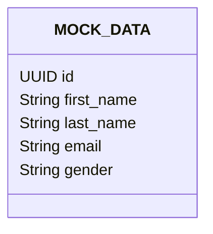

# Comando inicial para docker

Para levantar la imagen de la base de datos usamos este comando:

```powershell
docker-compose up
```

Esta imagen esta poblada con la `MOCK_DATA.sql`
En el caso de modificar la `MOCK_DATA.sql` hay que volver a hacer el `docker-compose up`.

# Credenciales

```yml
INFO:
  USER: postgres
  PASS: pepenacho
  PORT: 5432
```

# Fomato de Datos


